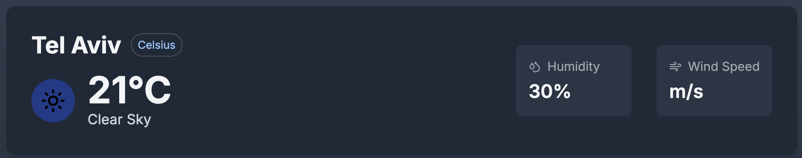
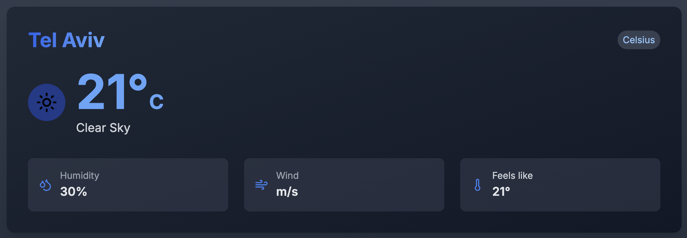

# Weather Dashboard Assignment

## Overview

This is a Weather Dashboard application built with *Next.js* 14 that needs some improvements and bug fixes. The application allows users to search for cities and view their weather forecasts, with A/B testing of different UI layouts.

## Setup Instructions

1. Download and unzip the attached file `rsn-app.zip`.

2. Install dependencies:

```bash
npm install
```

3. Obtain an API key from [OpenWeatherMap](https://openweathermap.org/) and configure it in the local environment for the project.
- Note: Sign up for an API key under your profile in the "My API Keys" section. No subscription is needed.

4. Create a `.env.local` file in the root directory with the API key.

5. Run the development server:

```bash
npm run dev
```

## Features to Implement

### 1. Integrate with Weather API
Implement integration with the `/location/search` and `/weather` API endpoints from the client components using server-side rendering (SSR), ensuring proper handling of their responses.

Refer to the [API Documentation](#api-documentation) section for details.

### 2. A/B Testing

Implement proper A/B testing with:
- Variant A: Minimal detailed list layout as shown below (already implemented!)
    
- Variant B: Card layout with a large temperature display and a detailed list layout with additional weather info as shown below (you need to implement as per the design below):
    

- Persist variant selection per session.

### 3. Create an About Page

- Navigate to the About page.
- The About page should contain a summary of the changes made.
- No special design is required, but keep the header layout consistent across all pages.
- Ensure responsive navigation between pages.

### 4. Current Issues to Fix
1. Recent searches show duplicate cities and do not persist between sessions.
2. A/B test variant isn't persisting between sessions.

*Note: A/B testing is a method used to compare two versions of a webpage, app, or other user experience to determine which one performs better.*

### 5. Bonus Task
#### Use Redux for State Management
- Integrate Redux to manage the application's state, such as A/B test variant selection.
- Update the components to connect to the Redux store and dispatch actions accordingly.
- Maintain a clean and organized state structure.

## Evaluation Criteria

Your solution will be evaluated based on:

- Feature implementation
- Quality of bug fixes
- Code organization and cleanliness
- Mobile responsiveness
- Include a summary of changes, any assumptions made, and any additional information you'd like us to know (in the About page).

## API Documentation

The app uses the [OpenWeatherMap](https://openweathermap.org/) API with two main endpoints:

1. Search Cities

```
GET /api/location/search?query={city}
```

2. Get Weather

```
GET /api/weather/{city}
```

## Time Limit

Task completion should take up to 4 hours for the core requirements.

## Submission instructions:
Please deploy the project to GitHub and share the repository link with instructions.

Good luck! :)
